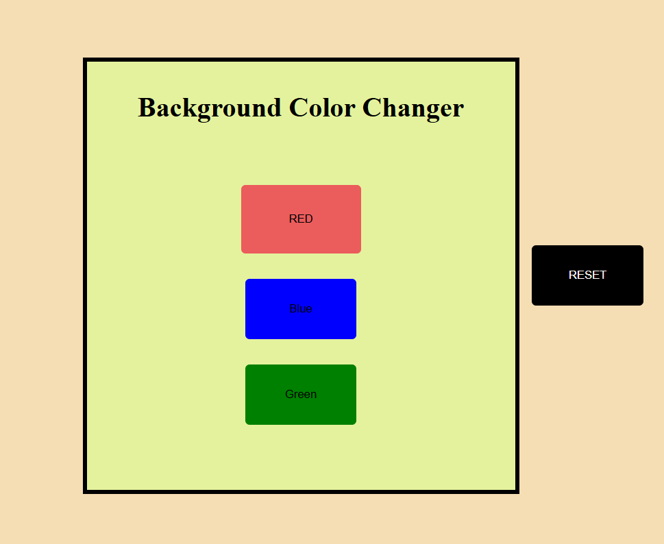

<h1>🎨 Background Color Changer</h1>

Welcome to the **Background Color Changer**! This is a simple project built with **HTML**, **CSS**, and **JavaScript** that allows users to choose a color and change the background color of the webpage.

---

    

---

## 🔥 **Features**

- 🎨 **Choose Colors**: Pick a color from present buttons.
- 🔥 **Instant Change**: The background of the page changes immediately when you select a color.
- 🔄 **Reset**: A button to reset the background to its original state.

---

## 🛠 **Technologies Used** 🛠

- **HTML**: Structure of the webpage 🏗
- **CSS**: Styling for the layout and buttons 🎨
- **JavaScript**: Functionality for color change 🖥

---

## 🖱 **How to Use** 🖱

1. Open the **index.html** file in your web browser.
2. Pick a color using one of the color buttons (Red, Green, or Blue).
3. Watch the background of the page change instantly! 💥
4. Click the **Reset** button to go back to the original background. 🔙

---

## 📁 **Project Structure** 📁

### **index.html** 🗂

Contains the layout of the webpage, including the color input and buttons.

### **style.css** ✨

Handles the look and feel of the page, including button styles and layout.

### **script.js** 🚀

Contains the JavaScript logic for changing the background color when a color is selected.

---

## 🏁 **Conclusion** 🏁

The `Background Color Changer` project is a fun and easy way to interact with color customization on a webpage. With just a few lines of HTML, CSS, and JavaScript, you can create a simple tool that lets users change the background color of a webpage.

Happy coding and have fun with colors! 🌟
