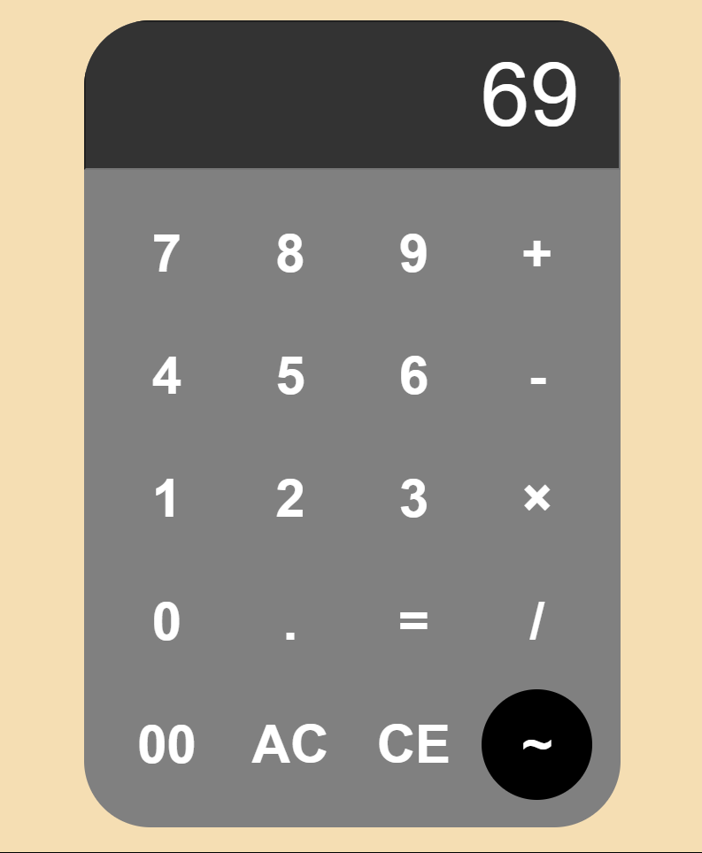

# Calculator Project 🧮

## 📌 Overview

This is a simple calculator application with a sleek and modern UI. It allows users to perform basic arithmetic operations like addition, subtraction, multiplication, and division.

## 🎨 Features

- User-friendly interface with a clean design.
- Supports basic arithmetic operations: `+`, `-`, `×`, `/`.
- Includes `AC` (All Clear) and `CE` (Clear Entry) buttons for efficient corrections.
- `~` button for additional functionality (customizable).
- Double zero (`00`) button for quick input.
- Responsive layout for different screen sizes.

## 🖼️ Preview

    

## 🔧 Technologies Used

- **HTML** for structure.
- **CSS** for styling.
- **JavaScript** for calculator logic.

## 🚀 Usage

1. Open the `index.html` file in a web browser.
2. Click the buttons to perform calculations.
3. Press `=` to see the result.
4. Use `AC` to reset everything or `CE` to clear the last entry.

---

💡 _Happy Calculating!_
