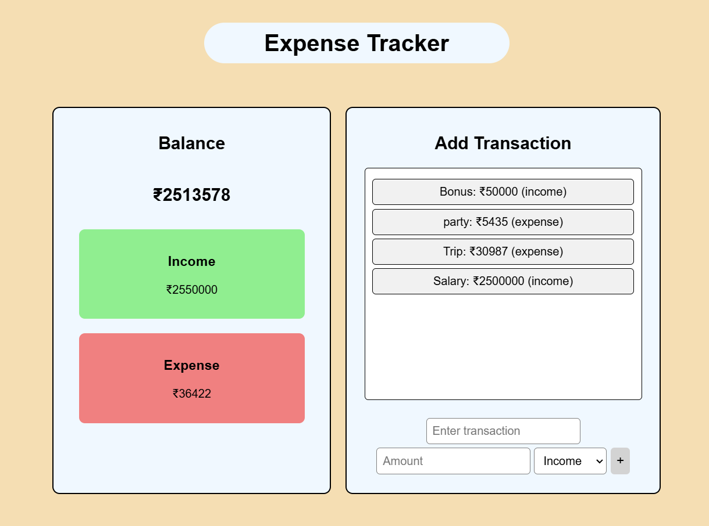

# 💰 **Expense Tracker** 💸

Welcome to the **Expense Tracker** app! A simple, clean, and engaging way to manage your **income** and **expenses**. 🚀  
Track your finances effortlessly with real-time balance updates, a scrollable transaction list, and smooth animations. Managing your finances has never been easier! 🎯

---

## 📌 **Features**

- **Add Transactions** → Name, Amount & Type (Income/Expense)
- **Real-Time Updates** → Automatically adjusts balance, income, and expenses 💹
- **Scrollable Transactions** → Keep history without clutter 🧾
- **Smooth Animations** → Transactions appear beautifully ✨
- **Clean & Responsive UI** → Works on any device 📱💻

---

<div align="center">
    
</div>

---

## 🏗 **Tech Stack**

- **HTML** 🏗 → Structure
- **CSS** 🎨 → Styling & Animations
- **JavaScript** ⚡ → Functionality

---

## 🚀 **How to Use**

1️⃣ **Clone the repository**

```bash
git clone https://github.com/AtharvaD1407/Mini-Projects.git
cd Expense Tracker
```
